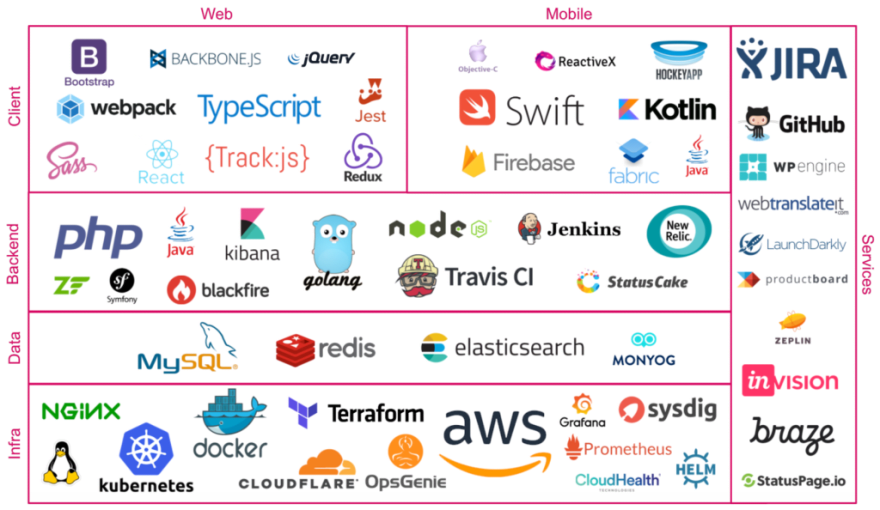
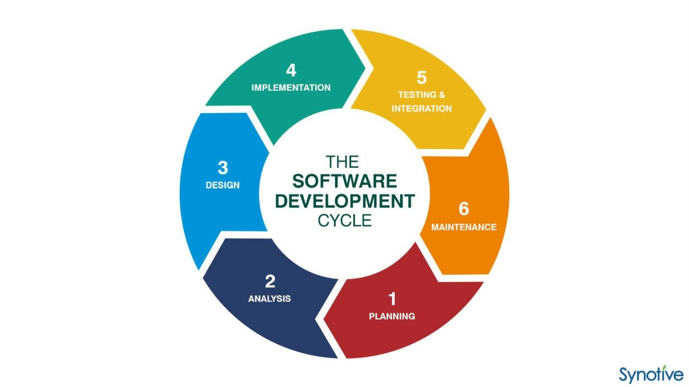
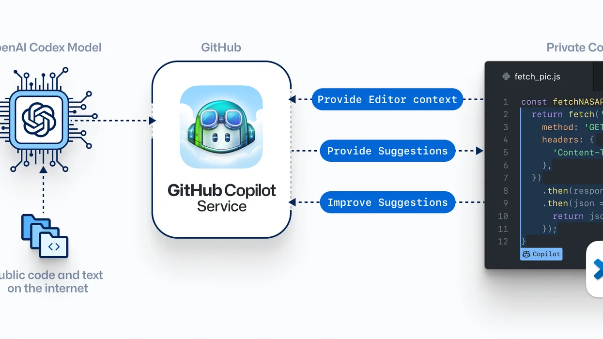

## Research

FYI, I haven't done any real production backend yet nor I had a chance to. But I was determined to try, research, and learn about it. The first thing I learned was 

> Software engineer is a constant progress of problem solving. 

There is no such thing as built once and done. There will be maintaince, bug fixing, new features or optimization. I learned this from an older friend who is a tech lead for 5+ years. That said, to have the most real experience, finding someone who need their software to be built and help them build it is the best way to learn. Alternatively, I also thought of building my own personal project but it has to be released to the public and maintained for a while.

Luckily, after I found one, the first thing I researched was what was the business needs: 
- How big is the company? What is the priority? Do they need to scale or just need to be built fast? 

The current boxes were: something cheap or even free until we have more profits, something that can be built fast, and something that can be scaled and customized. Then, I aligned this with what I already knew. 

### Tech stacks

Starting point: I have experience in Full-stack, DevOps, and Machine Learning. However, unlike DevOps, most of Full-stack and Machine Learning products I built was stopped at the prototype stage. I want to learn the best practices and how to build a real product that fit business needs.

Learning resources I used:
- [Backend roadmap](https://roadmap.sh/backend)
- [API Security](https://roadmap.sh/best-practices/api-security)
- System design interviews pt1&2 book.
- Design data-intensive applications book.
- Site Reliability Engineering from Google.
- Python for DevOps book.
- High Performance Python book.
- Robust Python book for clean and maintainable code. 
- Mutiple documentations.

Let's get started.

- I'm strongest in Python since I also do data engineering, which made development time faster. I do understand Go, JavaScript is better backend choice but there will make the development time longer.

    => I chose **Python**. For framework, I chose **Flask** due to its simplicity and support for both front-end and back-end. Will update to FastAPI later for better performance. At the moment, great performance is not the priority since user base is small. I find sometimes I have to link Python with JavaScript since the company also has a front-end team. Learning JavaScript is useful for this case.

- I have experience in full-stack and devops. The next things was finding what fits the budget. Use "back-of-the-envelope" calculation to estimate the cost, server need: 

    - SQL or NoSQL: 
    I found SQL is better and faster for query and data manipulation. But currently, the data is small and NoSQL databases out there aren't free. For SQL, I found AWS DynamoDB offer the most for free tier (25GB). After a while, I found it's quite stable and fast. They also have CloudWatch to monitor database performance but please turn them off if you don't need it to save cost. Once we have more profits, we can move to SQL.
    => Choice: NoSQL with AWS DynamoDB. 

    - Hosting: 
    I currently use **Render** free tier since they have very easy deployment with Flask. However, their free tier server will sleep unexpectedly after some inactivity. However, EC2 is the best choice with 12 months free tier and it is stable. CI/CD deployment with EC2 however is not easy. They requires a bunch of configurations and fixing bugs (devops) will be a pain for those who are not familiar with it once I left this project to someone else. 
    => Choice: **Render** for now. The goal is to move to EC2 once working MVP is done. 

    > For server, profiling and load testing your software will help determine how much RAM you will need. For CPU, the more CPU will help with the better performance. 

    - Email service: 
    I found **AWS SES** is the best for free tier for my need. It's stable and fast. They also offer customization HTML. The email verification email, however, needs production access from AWS, which requires some communication with the company.

    - CI/CD: 
    I found **GitHub Actions** is the best for this case since the company is small and the deployment is simple. Its free tier is also enough for this case.

That's all the simple needs for the backend. We will talk more about the customizations and scaling later.

## Development

1. The first thing I would do is to confirm the architecture, tech stack, and database schema with the tech lead/CTO/tech manager. Then, estimate the deadline for each features and also collaborate with non-tech managers to align the deadline with the business needs. This whole process will take around 1-2 weeks. Think of it from user perpective on how they would use this product. Raise the questions "what if?" to cover test cases. 

> Remember that not all businesses will need a lot of technology. Be flexible and aim for solving the problems. 

An example can be from how you create user id to will read or write will be more frequent? What kinds of data type and data structure will be used? What kind of database will need TTL (time to live)? Do we need to use cache? (my case yes, it was a lot faster).     

2.  Then, I follow the deadlines to build small features. Anything big can be achieved by breaking it down to smaller tasks. I used Github Issues and Projects to manage the tasks. 

- I tested interacting with databases, sending emails on local, etc. 
- Then, I figured to deploy the server. 
- Then, I configured the Github Actions and API to manage the flows. 
- Once I tested the product myself fully, I asked tech people in the team to first test it to see errors I couldn't see myself. 
- Once all is satisfied, I tested with non-tech people to see if the product is easy to use for first time users.

> I found Copilot is super helpful to make deployment and testing faster. However, supervision is needed since it can make mistakes. 

> The flow above looks simple but what took me longest was making sure all the edge cases was covered and the product is easy to use to fit the business needs. That comes to optimization. 

## Optimization

SWE is not a deployed and done. It's a constant progress. I found that the most important thing is to make sure the product is easy to use and fast. An example can be if the user has to wait 5s for the server to respond, they will leave. 

I found this server slowness comes from a few reasons. And also there are some questions I asked myself to improve the product: 
- Server sleeps. Is there any way we can prevent this?
- Lookup time is slow. Can we cache the data? or improve the algorithm?
> An example is if we want to find the customer with most orders and there are a lot of finding and customers adding, we can use a heap?

- Server has "503 error" when deploying. Can we stage the deployment with dev, staging, and production with different servers? If we have test server, do we have authentication so only the team can access it?
- How can we prevent this from happening again? Do we have monitoring tools? Did we do profiling and performance testing?
- For scaling, what are our SLOs (service level objectives)? What are our SLAs (service level agreements)? What are our KPIs (key performance indicators)? How do we measure them? and how do we improve them?
- Testing will other people always have bugs. Did we have a good testing practices before deploying?
- Did we have A/B testing? Did we have a way to rollback if the new feature is not working?
- Did we have a way to alert the team if the server is down? or if the automation is not working?
- Did we handle null, repeated sent emails, or other edge cases?
- Did we have type checking and error handling?
- Do we have rate limiting to avoid spamming and DDoS attacks?
- How do we handle logs and tracing?
- Is our API secure? Did we use JWT? Did we use HTTPS? Did we use CORS?
- Did we make automation and documentation for the next person who will take over the project?

> It might sound a lot but it do get better and you will learn a lot from it. I found the term **10x engineer** is also related to this? In a meeting with non-tech people, the **10x engineer** already tested their software throughly, can answer questions, and add features that might be useful later. That way, they finish the project faster and can move to the next project.

Back to optimization with Python, here are the tools I used: 
- Testing: Pytest 
- Profiling: cProfile with SnakeViz
- Monitoring: Sentry or Flask_monitoringdashboard (FMD is quite buggy and not recommended for production). Grafana and Prometheus are also good but they require a lot of configurations, espcially DevOps, will be used in the future.
- Load testing: Locust
- Tracing: Sentry 
- Automation: GitHub Actions
- Rate limiting: Flask-Limiter
- Logs: logger from loguru
- Business visualization: AWS CloudWatch. In the future, I will use Grafana. 
- Documentation: Sphinx or FastAPI/docs
- Authentication: this part, I recommend Auth0 for its simplicity and security.

All of this, I made Makefile automation to make it easier for the next person to take over.

### Future development
- Monitoring: Grafana and Prometheus
- Server: EC2
- Database: SQL
- Upgrade Github Team to have merge check and staging environment. 
- Use FastAPI for better performance.

## Finish

At the time I wrote this post, the project is done or might be tested for the release. The current cost (for all the open-source tools I used) is nearly $0 for +250,000 emails sent/year (more observation will be needed in the future). I followed all the best practices from [Backend roadmap](https://roadmap.sh/backend). Looking back, I can see this is more than just reading as I can see and apply what I learned. I could also see what happens if I didn't do this or that. 

Things can be from how to build this product to what is the pros and cons of each tech stack, even at the language level. I got to test the performance of Python and Go, Rust server because I was genuinely curious. 

From my observations, junior developers can make things perfectly if there are instructions. But when things aren't clear, more seniority is needed. An example would be a junior developer can learn everything about system design from books and interviews practices but a senior developer will know the pros and cons and if it it's suitable for the business. That is where the *experience* comes in. Can't trade it with AI. 

After this project, I have more confidence to step in bigger code bases. For those who are learning and wonder how to get good in tech, here is my recomendation:
- While at school, learn the basics well since you will need it later. All the new frameworks are based on the basics. Knowing the basics will help you know the pros and cons and how to improve the solutions. 
- Find a problem or someone who needs a software and help them build it. Get it done is not easy but you will get the foundation of how to build a software, espcially with others and for others.
- Read and apply. Reading is not enough. You need to apply it to see if it's true. Learning never stops.
- Be curious. Always ask "why" and "what if".
- Once you feel comfortable, step out of your comfort zone: find an internship, reasearch project, job, or collaborate on an open-source project. The point is to learn from others and see how they do things. Learn to use Git properly with a large team.
- Duirng doing these, learn from your mentors and peers. They can be the managers or the people you work with. They can be the people you meet at meetups or online.

> Remember, SWE is not just coding. Sometimes, to solve the problem, you need to talk to people, understand the business, and understand the users. The end goal is to solve the problem as the core of engineering. In the real world with competiton, solving problem will also involve solving it faster and better. 

## My take on AI and my learning

Current LLM is far from AGI aka human doing nothing. But it's undeniable we got more done with less resouces (one senior developer with AI compare with the cost of 1 senior, 2 junior developers). Since training AI will also be costly, cutting costs and laying off is inevitable. Of course, there will be jobs for AI but it will take time for the market to adjust and more barriers to entry (Masters and PhD to get a role in AI on average). But AI is a must for the future. Looking back on human development, technlogy will advance and we will have to adapt.

That's why I feel the immediate needs to upskill of what I already know and also broaden my skills with AI. The question is at the end, if nobody will hire me, can I build my own product? What skills do I need? What people do I need to get in my team? Or if say opening a company is too hard, can I freelance and build products for others? What tech and non-tech skills do I need? Experience is so important in this case. 

When I had less real-life experience, my tech stack came from big names like Google (Firebase, GCP, etc) and AWS. They all have free tier to encourage people to use their products. I made poor code and optimization because everything was free. But when I had more experience, I learned more about the pros and cons of each product. For example, can Firebase, which was free and easy to use, handle the load of a big company? Can AWS, which was more complex and costly, be used for a small company?

> I found that in a company. CEO is often more optimist and CTO is often more pessimist. Optimism from the CEO helps sales, and calls for more investment. Pessimism from the CTO helps determine the cost and deployment of the tech stacks. Both are important and reliable on each other. 

I also learned about the importance of the community. An example is if you have a problem, you can ask the community. Not everything can be answered from StackOverflow, Medium, or AI (ChatGPT). You might have to contact the person who wrote the code and ask them or anyone related. Communication is not hidden for SWEs. 

## Conclusion
I hope this post is helpful for those who are learning and those who are curious about how to build a backend. Stay tuned! I will write more about my learning in the next posts. 

If you want to collaborate or hire me to solve your problems, please contact me at [email](mailto:locvicvn1234@gmail.com). I'm also open to any feedback and questions.

